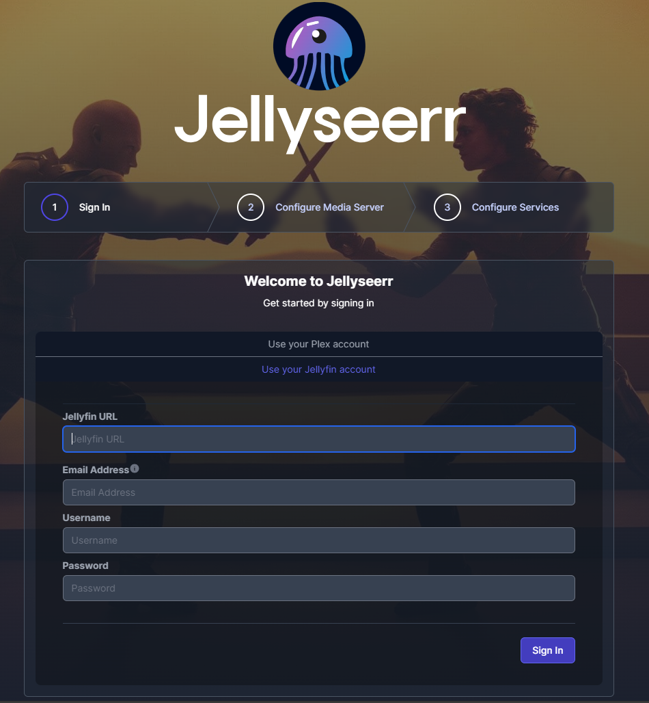
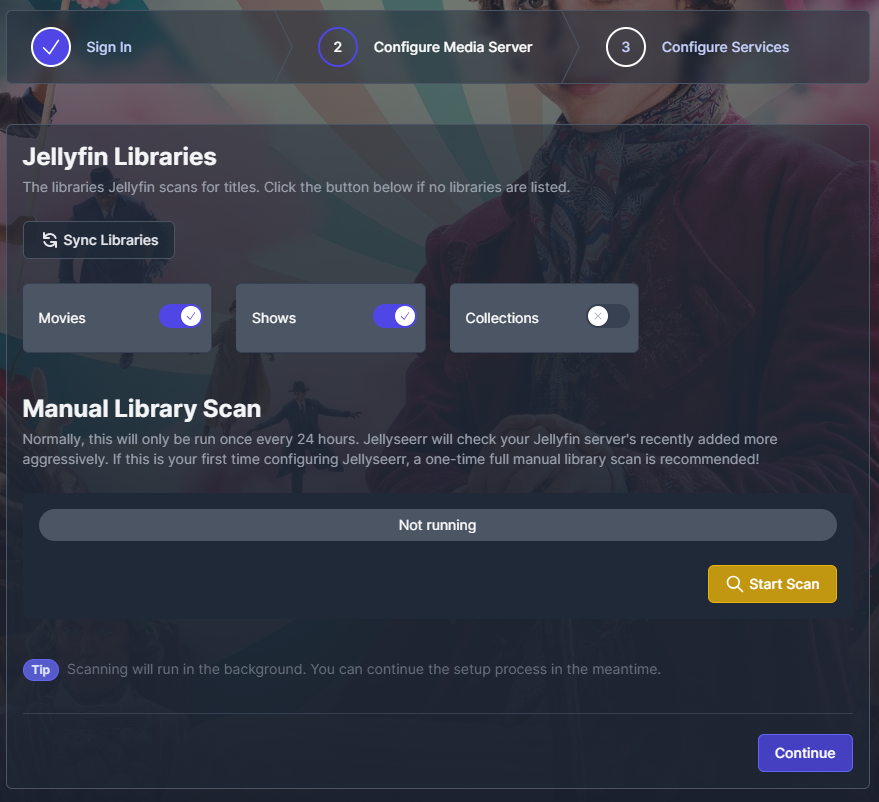

**seerr** is a free and open-source software application for managing requests for your media library. It is a fork of [Overseerr](https://github.com/sct/overseerr), built to bring support for [Jellyfin](https://github.com/jellyfin/jellyfin) and [Emby](https://github.com/MediaBrowser/Emby) media servers!

## App Installation

- Most of the settings can be left at their default values, but ensure that you have set the correct timezone.

## seerr Initial Setup

- Select "Use your Jellyfin account" and fill in your Jellyfin URL, Email address
- Define a user to be used for administrative purposes in **seerr** and click next.



- Sync your libraries automatically and enable any libaries you want Jellyseer to be able to access.
- Perform a manual scan and click next after it finishes.



- Configure your existing Sonarr/Radarr services you wants to use and click "Finish Setup".

## Migrating Sqlite to Postgres(CNPG)

Create a temp sidecar as below and add `targetSelectAll: true` to the config storage to allow the sidecar to access the data to read the db and migrate the data.

Check the logs for the container and verify the postgres data was populated, you can install another chart `pgadmin` to validate the database if needed. You can remove the `migrate` sidecar, `migrateImage` and `targetSelectAll: true` after confirming the data is migrated.

```yaml
    migrateImage:
      repository: ghcr.io/ralgar/pgloader
      pullPolicy: IfNotPresent
      tag: pr-1531@sha256:e5ae0b8149058828938d0f14ccc1f793171db8c4c8b69b7b6b45dfd998f0149f

    workload:
      main:
        podSpec:
          containers:
            # main:
            migrate:
              enabled: true
              imageSelector: migrateImage
              probes:
                liveness:
                enabled: false
                readiness:
                enabled: false
                startup:
                enabled: false
              args: 
                - pgloader
                - --with
                - "quote identifiers"
                - --with 
                - "data only"
                - /app/config/db.sqlite3
                - "{{ .Values.cnpg.main.creds.std }}"

    persistence:
      config:
        enabled: true
        targetSelectAll: true
```

## Support

- For further information on **seerr** itself, start with their [Github](https://github.com/seerr-team/seerr).
- For further information on operating **Overseerr** itself, start with their [Documentation](https://docs.overseerr.dev/).
